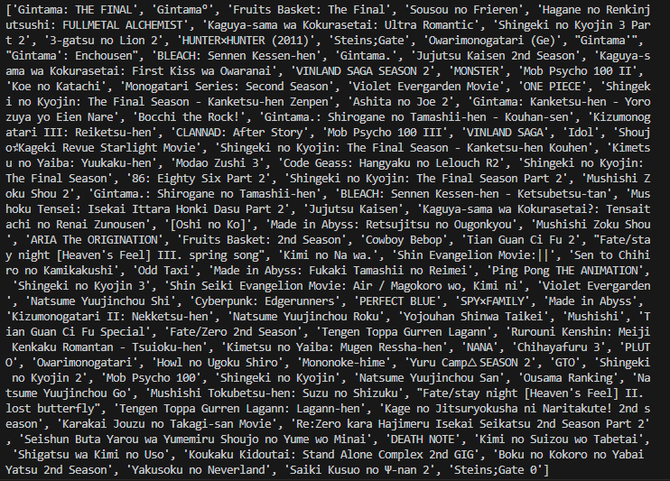

## 1.  Projekta uzdevumus

Šī projekta galvenais uzdevums bija radīt programmu, kas varētu sastādīt sarakstu ar anime, kurus es varētu skatīties un man visdrīzāk arī patiktu. Lai to izdarītu ši programma savāc datus no mājaslapas "Anilist", kur ir pieejami dažādi dati par lielu klāstu anime. Sākot ar anime, kam reitingi bija viss augstākie, un ejot dilstošā sēcībā programma iegūst datus par to vidējiem retingiem un kādi žanri tiem ir. Tad, atkarībā no žanriem un retinga, anime teik pievienoti sarakstam.

##  
(saraksts pēc dažām minūtēm)

## 2.  Izmantotās bibliotēkas 

import selenium - selenium bibliotēka atļau veikt darbības ar mājaslapām, kā arī iegūt informāciju no tām.
from selenium.webdriver.chrome.service import Service - šis atļau iedarbināt un apturēt chromedriver, jeb atvērt pārlūku.
from selenium.webdriver.common.by import By - šis atļau atrasts specifiskus elemetus izmantojot lokātorus, piemēram, CLASS_NAME, XPATH.
from selenium.webdriver.chrome.options import Options - palīdz ar Chrome opcijām, piemēram, .add_argument("--ignore-certificate-errors").
from selenium.common.exceptions import NoSuchElementException - lai varētu izveidot izņēmumus, piemēram, except NoSuchElementException:. Šajā gadijumā, ja nav tāda elemeta, tad beigt ciklu.
from selenium.webdriver.support.ui import WebDriverWait - pagaida nepieciešamo laiku lai varētu manipulēt noteikto elementu.
from selenium.webdriver.support import expected_conditions as EC - piedāvā dažādus izņēmumus, piemēram, presence_of_all_elements_located pārbauda, vai tīmekļa lapā ir vismaz viens elements.
import time - izmnatots kodā lai nopauzētu kodu uz pāris sekundēm, lai nebutu errors un lai lapa var ielādēties.

## 3. Izmantošanas metodes

https://youtu.be/PVqkgVMZ-vo (tkintre poga)
https://youtu.be/_gvKDgkRrvU (bez pogas)

Kods nestrādā github-codespace, jo codespace tiek mitināti uz Linux, bet kods strādā tikai uz windows platformām.
Izmantojiet open_app.py lai uzsāktu programmu!

